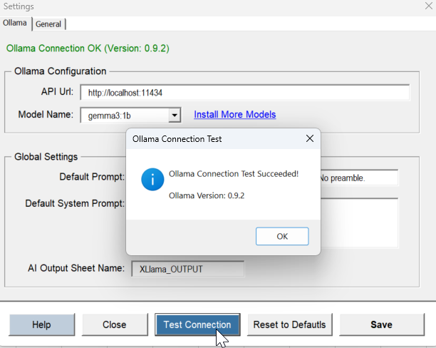

# Failed to get a valid response from Ollama (HTTP Status: 408)

If you're seeing this error:

**`Failed to get a valid response from Ollama. (HTTP Status: 408 - Server message: Request Timeout: The operation timed out)`**

Follow the steps below to resolve it:

***

**✅ Step 1: Check the Ollama Connection**

1. In Excel, go to the **XLlama** tab and click **Settings**.
2. In the settings window, click the **Test Connection** button.

* If the connection test **succeeds**, move to the next step.
* If it **fails**, make sure Ollama is installed and running in the background.

**🛠 How to start Ollama**

* **Windows:** Use the Start menu search bar and look for **Ollama**. Click to launch.
* **macOS:** Open **Launchpad** or use Spotlight search. Once running, you should see the Ollama icon in the menu bar (top right).

Now go back to Excel and try the **Test Connection** button again.

<figure><figcaption></figcaption></figure>

***

**✅ Step 2: Try a Simple Prompt**

If the connection works but you still get the error when running a prompt:

* Try something lightweight like:\
  `=XLlamaPrompt("Tell me a joke")`

If that works, it means the issue is not with the connection — it's that your original prompt was too large or complex for your system to handle in time.

So, what can you do?

* **Use a smaller model**\
  Heavier models (like `llama2:13b`) need a lot of resources. Try switching to something lighter, like `gemma:1b`
* **Simplify your prompt**\
  Shorten your instructions and reduce the selected data. Start small and gradually expand.
* **Increase the timeout**\
  Go to the **General** tab in the Settings window and raise the timeout limit.\
  It's in milliseconds — so `120000` means 2 minutes.\
  Only do this if your machine can handle it.\
  .png>)

In most cases, using a simpler prompt or lighter model will fix it without needing to increase the timeout.
